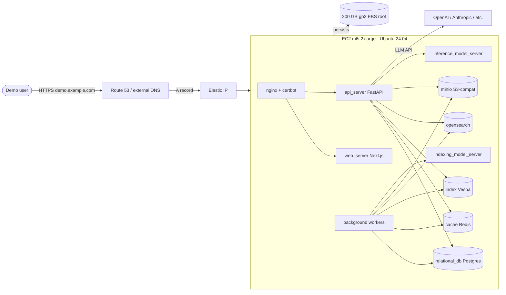

# Insight on AWS — Demo Deployment Guide

A self-contained runbook for standing up **Standard Insight** (full RAG stack: chat,
agents, connectors, Vespa, OpenSearch, model servers, workers, MinIO, etc.) on a
single AWS EC2 host, fronted by a custom domain with Let's Encrypt HTTPS.

> **Scope:** This is a **demo** deployment optimized for *fastest time-to-first-demo*
> and *lowest cost*. It is **not** production-grade. See
> [What this is *not*](#what-this-is-not) at the bottom for the production path.

---

## TL;DR

| Item | Value |
| --- | --- |
| Topology | 1× EC2 instance running all 12 containers via `docker-compose.prod.yml` |
| Recommended instance | `m6i.2xlarge` (8 vCPU, 32 GB RAM) |
| Storage | 200 GB gp3 EBS root volume |
| TLS | Let's Encrypt via the bundled `certbot` container |
| Time to deploy | ~45 minutes (mostly waiting on image pulls + DNS) |
| Cost (on-demand, 24/7) | ~$120 – $180 / month |
| Cost (stop when idle) | ~$30 – $50 / month |

---

## Architecture



All 12 services run as Docker containers on a single host. State (Postgres data,
Vespa indexes, OpenSearch data, MinIO buckets, model caches, certbot certs) lives
in named Docker volumes on the EBS root volume.

---

## AWS infrastructure recommendations

### Region

Pick the region closest to your demo audience. `us-east-1` and `us-west-2` are
good defaults — both have full ACM, Route 53, and EC2 capacity.

### EC2 instance

**Recommended: `m6i.2xlarge`** (8 vCPU / 32 GB RAM, ~$0.384/hr on-demand).

The full Standard stack has real memory needs:

| Service | Approx. RAM |
| --- | --- |
| Vespa (`index`) | 4 GB (heap is unbounded; ramp-up is large) |
| OpenSearch (`opensearch`) | 4 GB (Xms/Xmx 2g + overhead) |
| `inference_model_server` | 2 – 3 GB |
| `indexing_model_server` | 2 – 3 GB |
| Postgres + Redis + MinIO | ~1 GB combined |
| nginx + web_server + api_server + background workers | ~3 – 4 GB |
| OS + Docker overhead | ~1 GB |
| **Total recommended headroom** | **~24 GB minimum, 32 GB safe** |

Anything below 16 GB will OOM-kill Vespa or OpenSearch under any real load and
the demo will appear to "hang". `t3.2xlarge` (32 GB, burstable) is a viable
cheaper alternative for low-traffic demos but watch CPU credits.

| Class | Use when |
| --- | --- |
| `m6i.2xlarge` | Default. Sustained, predictable performance. |
| `t3.2xlarge` | Budget. Single-user demos with idle gaps. |
| `m6i.4xlarge` (16 vCPU / 64 GB) | You plan to ingest a lot of documents during the demo. |

### OS / AMI

Ubuntu 24.04 LTS (Canonical official AMI). Any region has one — find via:

```bash
aws ec2 describe-images \
  --owners 099720109477 \
  --filters "Name=name,Values=ubuntu/images/hvm-ssd-gp3/ubuntu-noble-24.04-amd64-server-*" \
            "Name=state,Values=available" \
  --query "sort_by(Images, &CreationDate)[-1].ImageId" \
  --output text
```

### Storage

- **200 GB gp3 root EBS** (3000 IOPS / 125 MB/s defaults are fine).
- Postgres data, Vespa index, OpenSearch data, MinIO buckets, Docker images, and
  Hugging Face model caches all live here. 200 GB gives comfortable headroom for
  a demo with a few thousand indexed documents.

### Networking

- **VPC:** Default VPC + default public subnet is fine for a demo.
- **Elastic IP:** Allocate one and associate it. Without it, your public IP
  changes every time the instance stops, breaking DNS.
- **Security Group (inbound):**

| Port | Source | Purpose |
| --- | --- | --- |
| 22/tcp | `<your IP>/32` | SSH |
| 80/tcp | `0.0.0.0/0` | HTTP → HTTPS redirect + Let's Encrypt HTTP-01 challenge |
| 443/tcp | `0.0.0.0/0` | HTTPS app traffic |

All other ports stay closed. Postgres, Redis, Vespa, OpenSearch, MinIO are only
reachable inside the Docker network.

### DNS

A single A record:

```
demo.example.com.   IN  A   <Elastic IP>
```

(Optional) `www.demo.example.com` CNAME to `demo.example.com` if you want both
hostnames covered by the cert — `init-letsencrypt.sh` will request both
automatically when `DOMAIN` is not a `www.*` value.

You can use Route 53 or any other DNS provider — only the A record matters.

### IAM

No EC2 instance role is required for the demo. Add one only if you later want to
back to S3 or use SES. MinIO inside the box already provides S3-compatible file
storage.

### Backups

Skip for a demo. If you want safety: enable EBS daily snapshots (~$0.05/GB-mo).

### Cost

Roughly, in `us-east-1`, on-demand:

- `m6i.2xlarge`: ~$280/mo if running 24/7
- `t3.2xlarge`: ~$240/mo if running 24/7
- 200 GB gp3: ~$16/mo
- Elastic IP (associated): free
- Data egress: negligible for a demo

**Pro tip:** stop the instance between demos. Stopped EC2 + EBS only costs
storage (~$16/mo). The Elastic IP keeps DNS pointing at the same address when
you start it back up.

---

## Prerequisites

- AWS account with permissions for EC2, EBS, Elastic IP, (optional) Route 53.
- Local `aws` CLI configured (`aws configure`).
- A domain you control (registered anywhere; you only need to set an A record).
- An LLM provider API key (OpenAI, Anthropic, etc.) — Insight is most useful
  with at least one provider configured. You can paste this into the admin UI
  after launch instead of putting it in `.env`.
- An SSH keypair created in the chosen region:

  ```bash
  aws ec2 create-key-pair --key-name insight-demo \
    --query 'KeyMaterial' --output text > ~/.ssh/insight-demo.pem
  chmod 400 ~/.ssh/insight-demo.pem
  ```

---

## Step-by-step deployment

Throughout the steps below, replace these placeholders with your own values:

| Placeholder | Example |
| --- | --- |
| `<REGION>` | `us-east-1` |
| `<KEY_NAME>` | `insight-demo` |
| `<MY_IP>` | `203.0.113.42` (your current public IP) |
| `<DOMAIN>` | `demo.example.com` |
| `<EMAIL>` | `you@example.com` (used by Let's Encrypt) |

### 1. Provision the EC2 instance

```bash
REGION=<REGION>
KEY_NAME=<KEY_NAME>
MY_IP=<MY_IP>

AMI_ID=$(aws ec2 describe-images \
  --region "$REGION" --owners 099720109477 \
  --filters "Name=name,Values=ubuntu/images/hvm-ssd-gp3/ubuntu-noble-24.04-amd64-server-*" \
            "Name=state,Values=available" \
  --query "sort_by(Images, &CreationDate)[-1].ImageId" --output text)

VPC_ID=$(aws ec2 describe-vpcs --region "$REGION" \
  --filters "Name=is-default,Values=true" \
  --query 'Vpcs[0].VpcId' --output text)

SG_ID=$(aws ec2 create-security-group --region "$REGION" \
  --group-name insight-demo-sg --description "Insight demo" \
  --vpc-id "$VPC_ID" --query 'GroupId' --output text)

aws ec2 authorize-security-group-ingress --region "$REGION" --group-id "$SG_ID" \
  --ip-permissions \
    "IpProtocol=tcp,FromPort=22,ToPort=22,IpRanges=[{CidrIp=${MY_IP}/32}]" \
    "IpProtocol=tcp,FromPort=80,ToPort=80,IpRanges=[{CidrIp=0.0.0.0/0}]" \
    "IpProtocol=tcp,FromPort=443,ToPort=443,IpRanges=[{CidrIp=0.0.0.0/0}]"

INSTANCE_ID=$(aws ec2 run-instances --region "$REGION" \
  --image-id "$AMI_ID" \
  --instance-type m6i.2xlarge \
  --key-name "$KEY_NAME" \
  --security-group-ids "$SG_ID" \
  --block-device-mappings '[{"DeviceName":"/dev/sda1","Ebs":{"VolumeSize":200,"VolumeType":"gp3","DeleteOnTermination":true}}]' \
  --tag-specifications 'ResourceType=instance,Tags=[{Key=Name,Value=insight-demo},{Key=app,Value=insight}]' \
  --query 'Instances[0].InstanceId' --output text)

echo "Instance: $INSTANCE_ID"

aws ec2 wait instance-running --region "$REGION" --instance-ids "$INSTANCE_ID"

ALLOC_ID=$(aws ec2 allocate-address --region "$REGION" --domain vpc --query 'AllocationId' --output text)
PUBLIC_IP=$(aws ec2 describe-addresses --region "$REGION" \
  --allocation-ids "$ALLOC_ID" --query 'Addresses[0].PublicIp' --output text)

aws ec2 associate-address --region "$REGION" \
  --instance-id "$INSTANCE_ID" --allocation-id "$ALLOC_ID"

echo "Elastic IP: $PUBLIC_IP"
```

Console alternative: launch an EC2 instance with the same parameters
(`m6i.2xlarge`, Ubuntu 24.04, 200 GB gp3, the SG above), allocate an Elastic IP,
and associate it.

### 2. Point DNS at the instance

Create an A record `<DOMAIN>` → `<Elastic IP>` in your DNS provider, then wait
for propagation:

```bash
dig +short <DOMAIN>
# Should print the Elastic IP. If it doesn't, wait 1-5 minutes and retry.
```

DNS must resolve **before** you run `init-letsencrypt.sh` or the HTTP-01
challenge will fail.

### 3. SSH in and install Docker

```bash
ssh -i ~/.ssh/<KEY_NAME>.pem ubuntu@<DOMAIN>

# On the EC2 host:
sudo apt-get update
sudo apt-get install -y ca-certificates curl gnupg git

sudo install -m 0755 -d /etc/apt/keyrings
sudo curl -fsSL https://download.docker.com/linux/ubuntu/gpg \
  -o /etc/apt/keyrings/docker.asc
sudo chmod a+r /etc/apt/keyrings/docker.asc

echo "deb [arch=$(dpkg --print-architecture) signed-by=/etc/apt/keyrings/docker.asc] \
  https://download.docker.com/linux/ubuntu $(. /etc/os-release && echo "$VERSION_CODENAME") stable" \
  | sudo tee /etc/apt/sources.list.d/docker.list > /dev/null

sudo apt-get update
sudo apt-get install -y docker-ce docker-ce-cli containerd.io \
  docker-buildx-plugin docker-compose-plugin

sudo usermod -aG docker ubuntu
exit
```

Reconnect so the `docker` group membership takes effect:

```bash
ssh -i ~/.ssh/<KEY_NAME>.pem ubuntu@<DOMAIN>
docker ps   # should succeed without sudo
```

### 4. Clone the repo

```bash
sudo mkdir -p /opt/insight && sudo chown ubuntu:ubuntu /opt/insight
git clone https://github.com/KoloqAI/Insight.git /opt/insight
cd /opt/insight/deployment/docker_compose
```

### 5. Configure environment files

The prod compose file needs **two** env files:

- `.env` — application settings
- `.env.nginx` — domain + email for nginx and Let's Encrypt

Create `.env`:

```bash
cp env.template .env
# generate secrets
USER_AUTH_SECRET=$(openssl rand -hex 32)
POSTGRES_PASSWORD=$(openssl rand -hex 16)
OPENSEARCH_ADMIN_PASSWORD="StrongPassword$(openssl rand -hex 4)!"
MINIO_PW=$(openssl rand -hex 16)

cat >> .env <<EOF

# --- demo overrides ---
WEB_DOMAIN=https://<DOMAIN>
AUTH_TYPE=basic
USER_AUTH_SECRET=${USER_AUTH_SECRET}
POSTGRES_PASSWORD=${POSTGRES_PASSWORD}
OPENSEARCH_ADMIN_PASSWORD=${OPENSEARCH_ADMIN_PASSWORD}
MINIO_ROOT_USER=insightadmin
MINIO_ROOT_PASSWORD=${MINIO_PW}
S3_AWS_ACCESS_KEY_ID=insightadmin
S3_AWS_SECRET_ACCESS_KEY=${MINIO_PW}
EOF
```

Create `.env.nginx`:

```bash
cat > .env.nginx <<EOF
DOMAIN=<DOMAIN>
EMAIL=<EMAIL>
EOF
```

> Auth choice: `basic` is the simplest for a demo — first user to register
> becomes admin. For Google OAuth, set `AUTH_TYPE=google_oauth` and fill in
> `GOOGLE_OAUTH_CLIENT_ID` / `GOOGLE_OAUTH_CLIENT_SECRET` (see
> `env.prod.template` for the full list).
>
> LLM key: leave `GEN_AI_API_KEY` unset and configure providers in the admin
> UI at `https://<DOMAIN>/admin/configuration/llm` after launch — it's safer
> than baking secrets into `.env`.

### 6. Issue Let's Encrypt certificates

The bundled script generates a temporary self-signed cert, brings up nginx,
runs the HTTP-01 challenge against `<DOMAIN>`, and swaps in the real cert.

```bash
cd /opt/insight/deployment/docker_compose
chmod +x init-letsencrypt.sh
./init-letsencrypt.sh
```

If the script fails on the challenge step:

- Confirm `dig +short <DOMAIN>` returns your Elastic IP.
- Confirm SG inbound 80/tcp is open to `0.0.0.0/0`.
- Re-run the script — it's idempotent.

### 7. Bring up the rest of the stack

```bash
docker compose -f docker-compose.prod.yml up -d
```

OpenSearch (`OPENSEARCH_FOR_ONYX_ENABLED=true`) and the MinIO file store
(`COMPOSE_PROFILES=s3-filestore`) are on by default; nothing extra to enable.

First boot pulls images and runs Alembic migrations — give it 3–5 minutes.

### 8. Verify

```bash
docker compose -f docker-compose.prod.yml ps         # all "Up"
docker compose -f docker-compose.prod.yml logs -f api_server   # watch boot

# from your laptop:
curl -sSf https://<DOMAIN>/api/health   # expect 200 OK
```

Open `https://<DOMAIN>` in a browser. With `AUTH_TYPE=basic`, the **first**
account you register is granted admin privileges — register that account
yourself before sharing the URL.

### 9. (Optional) Bootstrap demo content

To make the demo land, do these in the admin UI:

1. `/admin/configuration/llm` — add OpenAI/Anthropic/etc. and pick a default
   model.
2. `/admin/connectors` — add a Web or File connector and run an indexing pass
   so search has content.
3. `/admin/assistants` — create a custom agent that exercises the connector.

---

## Operations cheatsheet

```bash
cd /opt/insight/deployment/docker_compose

docker compose -f docker-compose.prod.yml ps                   # status
docker compose -f docker-compose.prod.yml logs -f api_server   # tail one service
docker compose -f docker-compose.prod.yml restart api_server   # restart one service
docker compose -f docker-compose.prod.yml pull \
  && docker compose -f docker-compose.prod.yml up -d           # update images

# Pause demo to save money (data is preserved)
aws ec2 stop-instances --region <REGION> --instance-ids <INSTANCE_ID>
aws ec2 start-instances --region <REGION> --instance-ids <INSTANCE_ID>

# Full teardown
docker compose -f docker-compose.prod.yml down -v   # destroys volumes!
aws ec2 terminate-instances --region <REGION> --instance-ids <INSTANCE_ID>
aws ec2 release-address --region <REGION> --allocation-id <ALLOC_ID>
```

---

## Troubleshooting

| Symptom | Likely cause | Fix |
| --- | --- | --- |
| `502 Bad Gateway` from nginx for the first ~3 min | `api_server` is still running Alembic migrations | Wait, then `docker compose logs api_server` |
| `index` (Vespa) container exits with `OOMKilled` | Instance < 32 GB RAM | Resize to `m6i.2xlarge` or larger |
| `opensearch` fails with `max virtual memory areas vm.max_map_count [65530] is too low` | Kernel sysctl on host | `sudo sysctl -w vm.max_map_count=262144` and add to `/etc/sysctl.conf` |
| `init-letsencrypt.sh` fails on cert request | DNS not propagated, or port 80 blocked | `dig +short <DOMAIN>`, check SG, retry |
| Cert renewal fails 60 days in | Same as above | Renewal is automatic via the `certbot` service; just keep port 80 open |
| LLM responses error out | `GEN_AI_API_KEY` missing or wrong provider | Configure providers in `/admin/configuration/llm` |
| `docker: permission denied` | `ubuntu` user not yet in `docker` group | Log out and SSH back in |
| Disk fills up after a few days of indexing | Vespa + Docker image churn | Increase EBS volume, or run `docker system prune -a` |

---

## Demo hardening (optional)

- **Restrict signup:** set `VALID_EMAIL_DOMAINS=example.com` in `.env` so only
  invited domains can register.
- **Restrict access by IP:** narrow the 443 rule in the security group to your
  audience's CIDR, or front the box with CloudFront + WAF IP allow-list.
- **Lower data retention:** set `HARD_DELETE_CHATS=true` in `.env` if the demo
  may handle anything sensitive.
- **Disable telemetry:** set `DISABLE_TELEMETRY=true` in `.env`.
- **Branding:** the Insight fork already replaces user-visible Onyx strings; no
  extra steps needed.

---

## What this is *not*

This deploy is **demo-grade**, not production-grade. Specifically:

- Single AZ, single host — no HA, any failure brings the demo down.
- Self-hosted Postgres, Redis, Vespa, OpenSearch, MinIO — no managed services,
  no automatic failover, no point-in-time recovery.
- No automatic backups (only optional EBS snapshots).
- No horizontal scaling — model servers and workers can't scale out.
- All secrets live in a `.env` file on the host.

For production, switch to one of the existing infra-as-code stacks already in
this repo:

- **ECS Fargate (CloudFormation):**
  [`deployment/aws_ecs_fargate/cloudformation/`](deployment/aws_ecs_fargate/cloudformation/) —
  managed containers, EFS, ALB, ACM. See
  [`deployment/aws_ecs_fargate/cloudformation/README.md`](deployment/aws_ecs_fargate/cloudformation/README.md).
- **EKS (Terraform):**
  [`deployment/terraform/modules/aws/`](deployment/terraform/modules/aws/) —
  full EKS + RDS Postgres + ElastiCache Redis + S3 + (optional) OpenSearch +
  WAF, with the Helm chart in [`deployment/helm/`](deployment/helm/) for the
  application layer. See
  [`deployment/terraform/modules/aws/README.md`](deployment/terraform/modules/aws/README.md).
